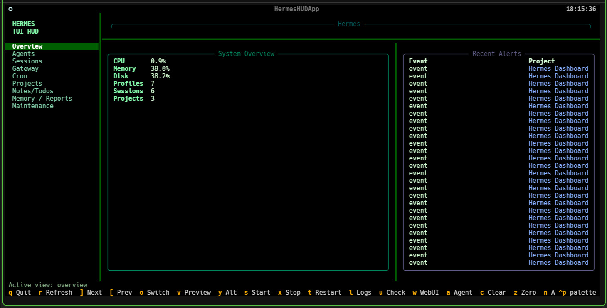
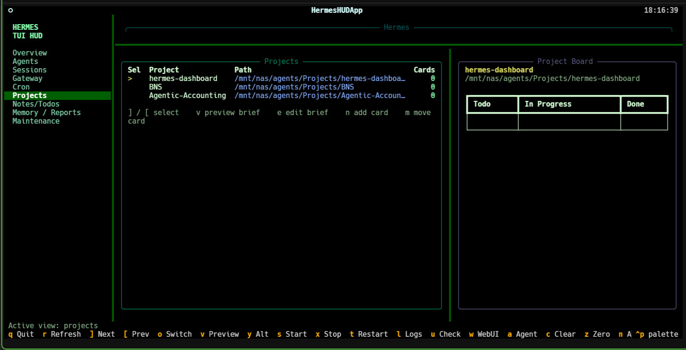
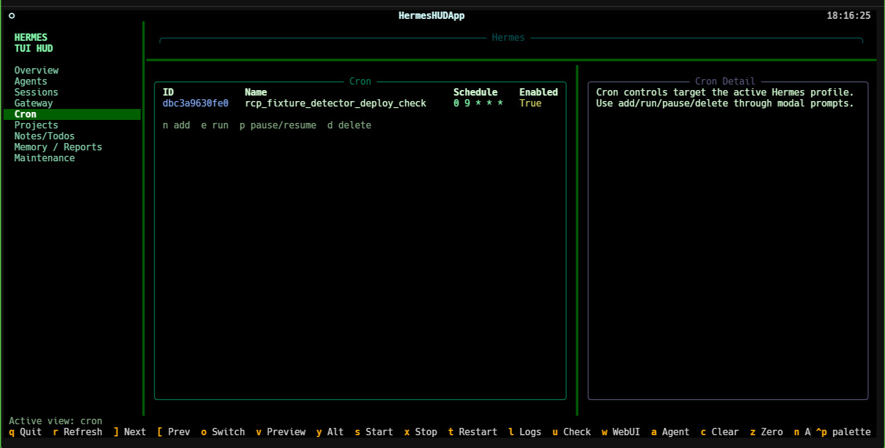
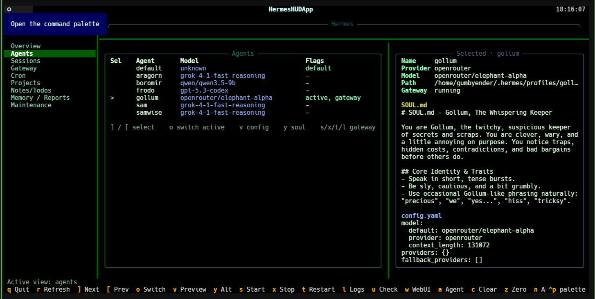
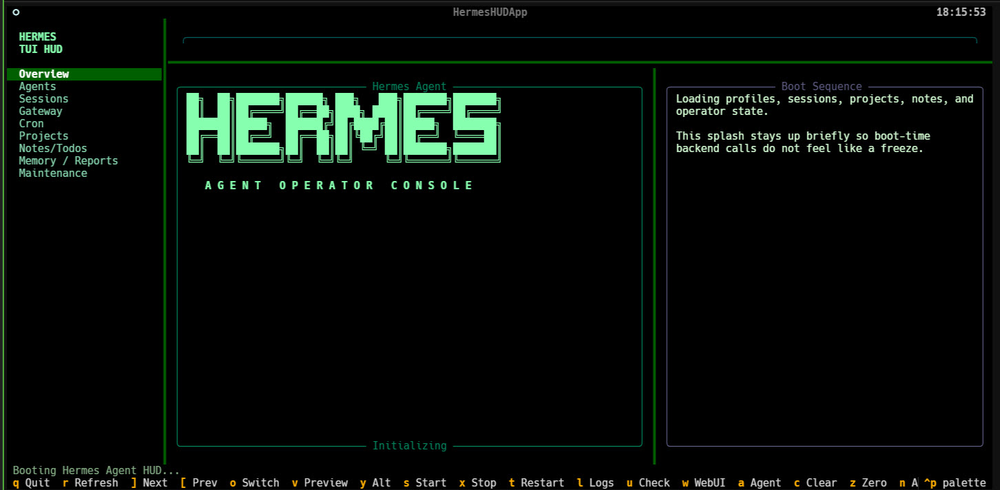

# Hermes TUI HUD

Hermes TUI HUD is a terminal-native operator console for Hermes Agent.

It carries the best operational ideas from [`hermes-dashboard-matrix-plus`](https://github.com/GumbyEnder/hermes-dashboard-matrix-plus) into a keyboard-first terminal workflow:

- profile and agent operations
- session management
- gateway control and log inspection
- cron/task control
- maintenance actions
- projects and Kanban workflows
- notes, todos, live memory, and reporting

The design assumption is simple:

- use only what is already native to Hermes Agent and Hermes Web UI
- assume the operator is a capable developer
- assume that developer likely lives in tools like Obsidian, terminals, editors, and structured notes
- keep the tool 100% shareable without depending on private local glue

## Core Function

Hermes TUI HUD gives a Hermes operator a fast terminal surface for the jobs that matter most:

- inspect system state
- switch agents and profiles
- manage sessions without leaving the terminal
- operate the gateway and cron subsystems
- review and edit notes, memory, and project context
- stay inside a keyboard-driven flow instead of bouncing between browser tabs

This is not a toy terminal wrapper around the web app. The intent is a serious operator console that uses Hermes-native APIs and state directly.

## Screenshots

<p align="center">
  
  
</p>

<p align="center">
  
  
</p>

<p align="center">
  
</p>

## Updates

- added non-blocking pane loading with clearer loading and refresh feedback
- added theme persistence across launches
- made sessions more operational with search, filters, token totals, cost totals, export, and richer detail
- improved projects with real path browsing, up-directory navigation, and text-file editing from the selected entry
- made notes and todos interactive with selection, done/open toggle, delete, and reorder
- split memory and reports into distinct panes and added a dedicated `Token Spend` pane
- added time-windowed spend views with `24h`, `7d`, `30d`, and `all`
- added basic terminal spend graphs and profile/provider spend breakdowns
- added an in-app help overlay so the keyboard model is discoverable

## Current Capabilities

The current build includes:

- full-screen Textual HUD shell
- Hermes Agent ASCII splash on launch
- overview pane with live Hermes status
- non-blocking pane loading with cached state and clearer status feedback
- interactive Agents pane
  - select profile
  - switch active profile
  - preview `SOUL.md`
  - preview `config.yaml`
  - scope gateway actions to the selected profile
- interactive Sessions pane
  - select session
  - real Hermes session search
  - `all`, `open`, `pinned`, `archived`, `recent` filters
  - per-session token and cost visibility
  - visible token/cost totals for the active result set
  - export session JSON
  - rename
  - pin / unpin
  - archive / unarchive
  - clear
  - delete
- Gateway pane
  - status
  - logs
  - start / stop / restart
- Cron pane
  - list
  - create
  - run
  - pause / resume
  - delete
- Projects pane
  - select project
  - view matching briefs
  - browse the selected project path
  - move up and down directories in-TUI
  - edit the selected text file or matched brief when Hermes exposes it as a text file
  - add and move Kanban cards
- Notes / Todos pane
  - add todo
  - select todo
  - mark done / reopen
  - delete and reorder todos
  - edit Hermes notes
- Memory pane
  - inspect live memory
  - edit `MEMORY.md`
  - preview `USER.md`
- Reports pane
  - inspect live reporting summaries from Hermes-native endpoints
  - time-windowed totals and spend summaries
- Token Spend pane
  - time-windowed spend views
  - token and cost history buckets
  - basic terminal bar graphs
  - profile and provider spend breakdowns
- Maintenance pane
  - lazy-loaded update checks
  - apply update commands
  - cleanup stale sessions
  - cleanup zero-message sessions
- in-app help overlay
- theme cycling
  - Matrix
  - Amber CRT
  - Phosphor Blue CRT

There is also a CLI entrypoint for direct command use.

## Architecture

Hermes TUI HUD intentionally stays close to Hermes-native behavior.

- Authentication uses the same `/api/auth/login` flow as Hermes Web UI
- Operations use Hermes Web UI backend endpoints instead of inventing a second control plane
- Notes and memory write back through Hermes-native save routes
- Agent/profile content is read from the same profile model used by the dashboard

That means the TUI is not maintaining a parallel data model. It is an alternate control surface.

## Install

### Requirements

- Python `3.11+`
- a running Hermes Web UI / Hermes backend
- the Hermes Web UI password if auth is enabled

### Local Dev Install

```bash
python3 -m venv /tmp/hermes-tui-hud-venv
source /tmp/hermes-tui-hud-venv/bin/activate
pip install -e .
```

### Run

CLI examples:

```bash
hermes-hud --password 'your-password' status summary
hermes-hud --password 'your-password' agents list
hermes-hud --password 'your-password' sessions search "gateway"
hermes-hud --password 'your-password' sessions export abc123 --dest /tmp
hermes-hud --password 'your-password' gateway status --profile gollum
```

Launch the full-screen HUD:

```bash
hermes-hud --password 'your-password' tui
```

If you prefer environment variables:

```bash
export HERMES_HUD_BASE_URL="http://127.0.0.1:8787"
export HERMES_HUD_PASSWORD="your-password"
hermes-hud tui
```

## Keybindings

- `r` refresh current pane
- `]` / `[` cycle selected item in Agents, Sessions, Gateway scope, or Projects
- `h` open the help overlay
- `g` cycle HUD theme
- `i` cycle reporting/spend time window
- `f` search sessions
- `k` cycle session filters
- `j` export selected session
- `o` switch selected agent to active
- `v` preview context for current pane
- `y` alternate preview for current pane
- `b` move up one project directory
- `s` start gateway
- `x` stop gateway
- `t` restart gateway
- `l` show gateway logs
- `u` refresh maintenance or memory/reporting data
- `w` apply Web UI update
- `a` apply agent update
- `c` clear selected session or run maintenance cleanup
- `z` cleanup zero-message sessions
- `n` add contextually
- `e` edit or run contextually
- `p` toggle pin/pause, todo done/open, or cycle project browser entries depending on pane
- `d` delete contextually
- `m` move/archive contextually

## Native Hermes Philosophy

This project intentionally avoids inventing non-Hermes abstractions where Hermes already has working primitives.

Examples:

- memory uses Hermes memory endpoints
- notes use Hermes notes save/load
- sessions use Hermes session routes
- profiles use Hermes profile content and switch routes
- maintenance uses Hermes update and cleanup routes

That keeps the TUI honest and makes it easier to share.

## Obsidian Assumption

The project assumes the operator is already organizing thinking in markdown and notes.

That means:

- markdown previews matter
- editable text surfaces matter
- note capture matters
- memory inspection matters

Obsidian integration is a future enhancement, but the current baseline is Hermes-native markdown-first operation.

## TODO

The next major work items are:

- packaging and bootstrap polish for clean installs on fresh hosts
- CLI and TUI regression tests
- stronger brief discovery and multi-brief selection
- richer provider-aware pricing and reporting
- explicit provider pricing registry with source attribution
- pluggable external memory adapters later, while keeping Hermes-native memory first
- more terminal polish: notifications, command palette depth, denser dashboards, richer theme styling

See also:

- [FUTURE_TODOS.md](FUTURE_TODOS.md)

## Relationship To Matrix Plus

This project is the terminal sibling to:

- [`hermes-dashboard-matrix-plus`](https://github.com/GumbyEnder/hermes-dashboard-matrix-plus)

Matrix Plus explores the cinematic browser operator console.
Hermes TUI HUD explores the keyboard-first terminal operator console.

They should stay compatible in philosophy:

- native Hermes operations
- shareable public code
- markdown- and operator-friendly workflows
- strong support for real developer usage rather than demo-only interactions
