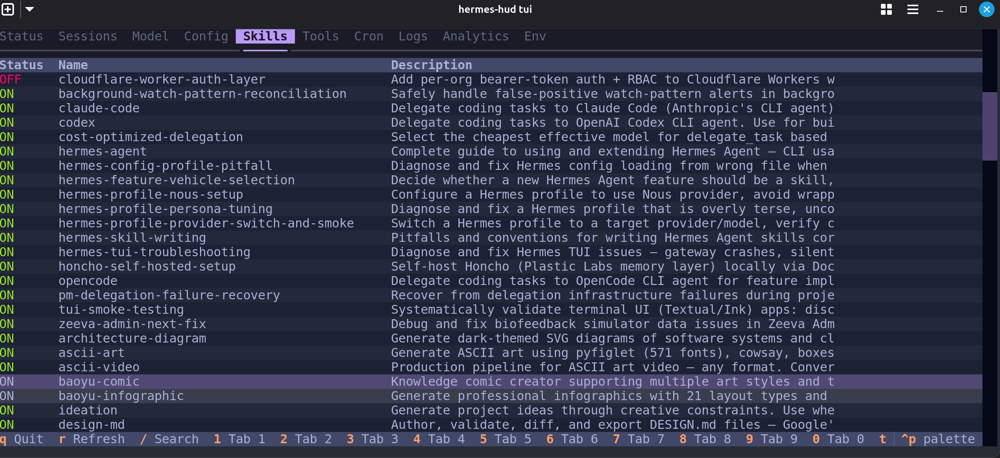
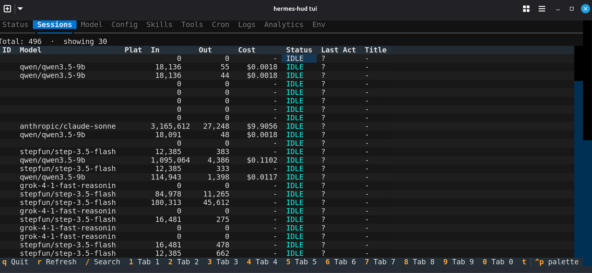
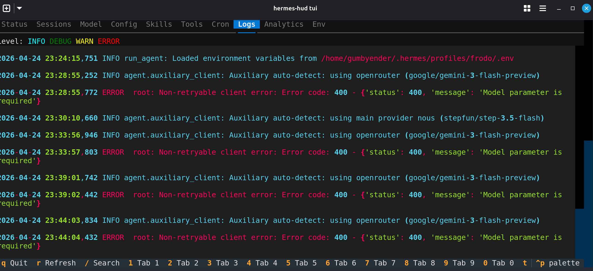
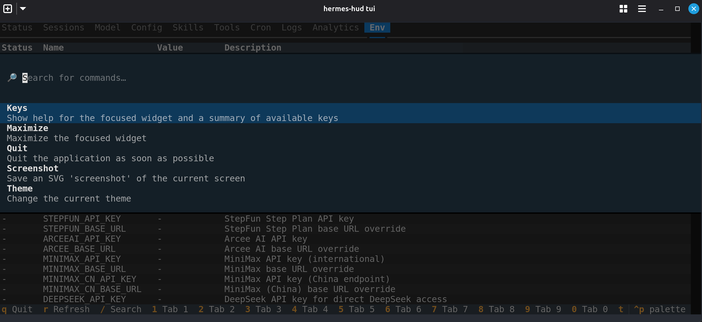

# Hermes TUI HUD

Hermes TUI HUD is a terminal-native operator console for Hermes Agent.

It carries the best operational ideas from [`hermes-dashboard-matrix-plus`](https://github.com/GumbyEnder/hermes-dashboard-matrix-plus) into a keyboard-first terminal workflow:

- profile and agent operations
- session management
- gateway control and log inspection
- cron/task control
- maintenance actions
- projects and Kanban workflows
- notes, todos, live memory, and reporting

The design assumption is simple:

- use only what is already native to Hermes Agent and Hermes Web UI
- assume the operator is a capable developer
- assume that developer likely lives in tools like Obsidian, terminals, editors, and structured notes
- keep the tool 100% shareable without depending on private local glue

## Core Function

Hermes TUI HUD gives a Hermes operator a fast terminal surface for the jobs that matter most:

- inspect system state
- switch agents and profiles
- manage sessions without leaving the terminal
- operate the gateway and cron subsystems
- review and edit notes, memory, and project context
- stay inside a keyboard-driven flow instead of bouncing between browser tabs

This is not a toy terminal wrapper around the web app. The intent is a serious operator console that uses Hermes-native APIs and state directly.

## Current Capabilities

Full-screen Textual HUD with ten operator-focused tabs:

- **HERO launch splash** with `HERMES HERO` branding
- **Dual layout modes** — `wide` (stacked left nav) and `stacked`/portrait (horizontal top-nav)
- **Status** — live Hermes gateway health, version, platform states
- **Sessions** — search, export JSON, rename, pin, archive, clear, delete
- **Model** — current model, provider, context limits, capabilities
- **Config** — inline YAML editor (view/edit with `e`, `Ctrl+S` to save)
- **Skills** — list skills; toggle enable/disable inline with `t`
- **Tools** — toolset registry and configuration status
- **Cron** — list, view schedule, last run; run/pause/delete planned
- **Logs** — live agent and gateway logs with color-coded levels
- **Analytics** — token spend by model, day-by-day usage
- **Env** — environment variables visible to Hermes (SET/unset, descriptions)

Themes: Neon Night (default), Vaporwave, Matrix, Amber CRT, Phosphor Blue. Effect modes: Full FX, Minimal, Low Noise Ops.

There is also a CLI entrypoint for direct command use.

## Screenshots

<div class="screenshot-gallery">

**Skills tab — toggle agent skills inline (Tokyo neon theme)**



**Sessions tab — inspect and manage active Hermes sessions**



**Logs tab — live color-coded gateway and agent logs**



**Command palette — quick action access**



</div>

## Architecture

Hermes TUI HUD intentionally stays close to Hermes-native behavior.

- Authentication uses the same `/api/auth/login` flow as Hermes Web UI
- Operations use Hermes Web UI backend endpoints instead of inventing a second control plane
- Notes and memory write back through Hermes-native save routes
- Agent/profile content is read from the same profile model used by the dashboard

That means the TUI is not maintaining a parallel data model. It is an alternate control surface.

## Install

### Requirements

- Python `3.11+`
- a running Hermes Web UI / Hermes backend
- the Hermes Web UI password if auth is enabled

### Local Dev Install

```bash
python3 -m venv /tmp/hermes-tui-hud-venv
source /tmp/hermes-tui-hud-venv/bin/activate
pip install -e .
```

### Run

CLI examples:

```bash
hermes-hud --password 'your-password' status summary
hermes-hud --password 'your-password' agents list
hermes-hud --password 'your-password' sessions search "gateway"
hermes-hud --password 'your-password' sessions export abc123 --dest /tmp
hermes-hud --password 'your-password' gateway status --profile gollum
```

Launch the full-screen HUD:

```bash
hermes-hud --password 'your-password' tui
```

If you prefer environment variables:

```bash
export HERMES_HUD_BASE_URL="http://127.0.0.1:8787"
export HERMES_HUD_PASSWORD="your-password"
hermes-hud tui
```

## Keybindings

- `r` refresh current pane
- `]` / `[` cycle selected item in Agents, Sessions, Gateway scope, or Projects
- `g` cycle HUD theme
- `G` cycle HUD effect mode
- `L` or `Ctrl+L` toggle HUD layout
- `Left` / `Right` switch sections in portrait mode
- `f` search sessions
- `j` export selected session
- `o` switch selected agent to active
- `v` preview context for current pane
- `y` alternate preview for current pane
- `s` start gateway
- `x` stop gateway
- `t` restart gateway
- `l` show gateway logs
- `u` refresh maintenance or memory/reporting data
- `w` apply Web UI update
- `a` apply agent update
- `c` clear selected session or run maintenance cleanup
- `z` cleanup zero-message sessions
- `n` add contextually
- `e` edit or run contextually
- `p` toggle pin/pause or cycle project browser entries depending on pane
- `d` delete contextually
- `m` move/archive contextually

In portrait / stacked mode, the top navigation is also clickable with the mouse.

## Recent Updates (v0.3.4-dev)

- Fixed Cron tab — API schema changes mapped correctly; all jobs now display
- Fixed layout — header and tabs stay pinned during refreshes
- Fixed config save — `Ctrl+S` priority binding ensures saves fire
- Fixed skill toggle — proper `enabled` payload sent to API
- Fixed palette cycling — no more crashes on `Ctrl+P`
- Added `schedule_display` field for human-readable cron schedules

## Native Hermes Philosophy

This project intentionally avoids inventing non-Hermes abstractions where Hermes already has working primitives.

Examples:

- memory uses Hermes memory endpoints
- notes use Hermes notes save/load
- sessions use Hermes session routes
- profiles use Hermes profile content and switch routes
- maintenance uses Hermes update and cleanup routes

That keeps the TUI honest and makes it easier to share.

## Obsidian Assumption

The project assumes the operator is already organizing thinking in markdown and notes.

That means:

- markdown previews matter
- editable text surfaces matter
- note capture matters
- memory inspection matters

Obsidian integration is a future enhancement, but the current baseline is Hermes-native markdown-first operation.

## TODO

The next major work items are:

- stronger brief discovery and multi-brief selection
- deeper session result detail and export workflows
- better memory analytics and provider-aware reporting
- pluggable external memory adapters later, while keeping Hermes-native memory first
- more terminal polish: notifications, command palette depth, denser dashboards, richer theme styling
- screenshots and polished public demo material

See also:

- [HERMES_TUI_HUD_PLAN_2026-04-15.md](HERMES_TUI_HUD_PLAN_2026-04-15.md)
- [FUTURE_TODOS.md](FUTURE_TODOS.md)

## Relationship To Matrix Plus

This project is the terminal sibling to:

- [`hermes-dashboard-matrix-plus`](https://github.com/GumbyEnder/hermes-dashboard-matrix-plus)

Matrix Plus explores the cinematic browser operator console.
Hermes TUI HUD explores the keyboard-first terminal operator console.

They should stay compatible in philosophy:

- native Hermes operations
- shareable public code
- markdown- and operator-friendly workflows
- strong support for real developer usage rather than demo-only interactions
